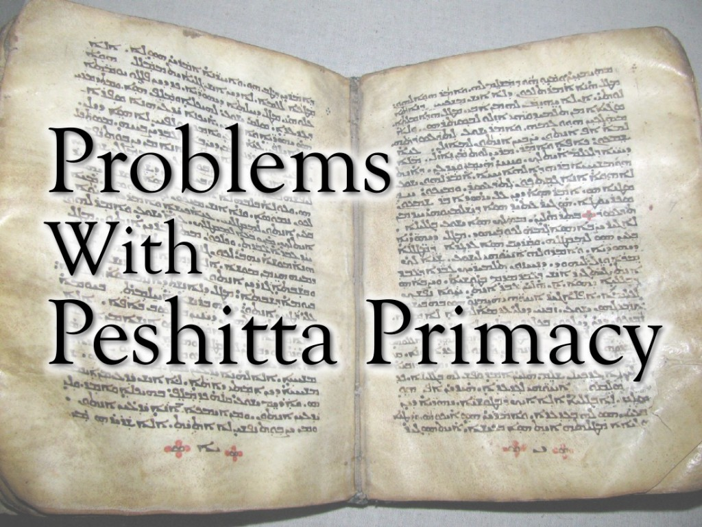
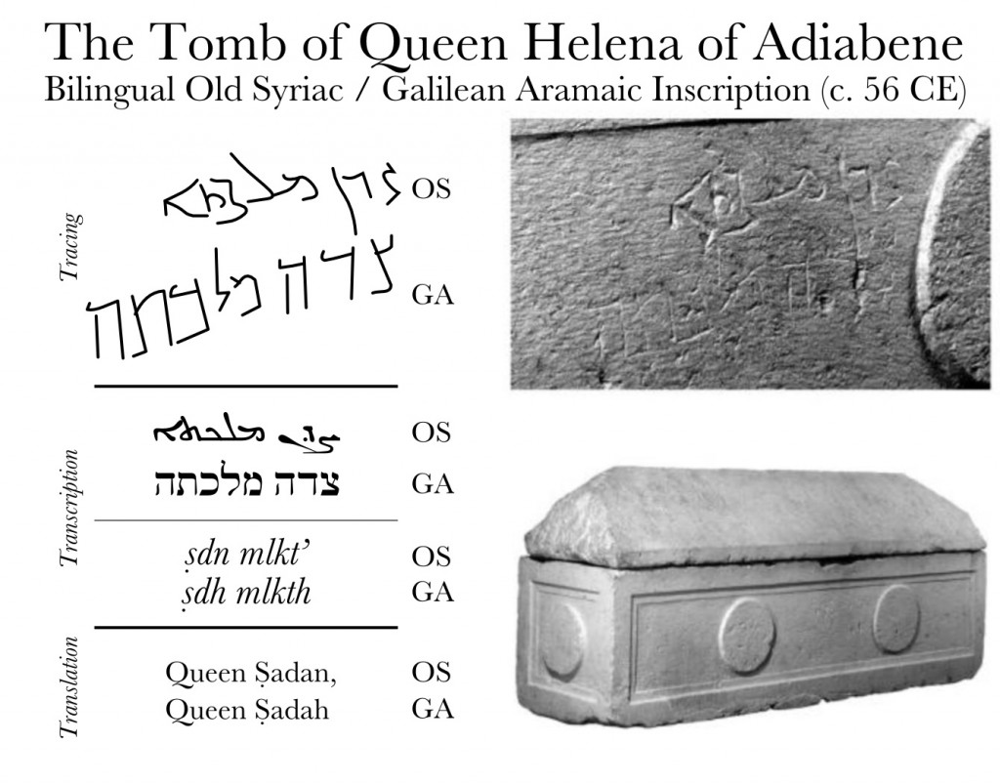

For those of you who are not familiar with **Peshitta Primacy**, it is the belief that the Syriac Peshitta (the Syriac Bible) is the original text of the New Testament.^[In contrast, most scholars conclude that the Peshitta is a ~4th century translation from the Greek and a revision of the prior Old Syriac tradition.] It is a movement that first gained traction with the works of the late George Lamsa, and is primarily a position popularized by individuals within the growing Messianic Judaism movement in North America as well as some popular figures within the Assyrian Church of the East (Mar Eshai Shimun, etc.).

On its face, the Peshitta Primacy movement makes some seemingly compelling arguments that have to do with places where the Peshitta text displays interesting quirks of idiom (such as wordplay, puns, or ambiguous meanings) that the Greek text of the New Testament, as we have it today, misses or potentially mistranslates.

However, when taking a closer look things are not _quite_ what they seem.

## Problems With Time & Place

Classical Syriac, the dialect the Peshitta is written in, is the most prolific classical Aramaic dialect. It had a golden age between the 5th and 8th centuries and spread all over the Middle East to parts as far as India and China. In light of its history, what can the actual _language_ of the Peshitta tell us about its _character_?

### The Wrong Language

Many Peshitta Primacy advocates claim that the Peshitta dates back to the first few centuries AD. Since it's written in Classical Syriac, and Syriac was spoken at that time, it seems logical that the text could be that old. The problem, however, is that not _all_ Syriac is equal.

If the Peshitta was written right after Jesus' lifetime, one would expect the dialect to match up with other inscriptions from the first few centuries. This particular dialect of Syriac is known as Old Syriac,^[This is not to be confused with the dialect of the "Old Syriac" Gospels. They are in early Classical Syriac and are merely "Old" relative to the Peshitta. Aramaic nomenclature can sometimes be problematic due to points of reference. For example, one often refers to "Eastern" and "Western" Syriac, but both of these dialects are Eastern Aramaic languages. (They are merely "eastern" and "western" when compared to each-other.)] and is attested in about 80 different inscriptions. So when we compare the two what do we find are some very curious and telling differences.

All verbs in Aramaic start out as a "root" of (usually) 3 letters that express a particular concept. From there, prefixes, suffixes, and vowels are added to indicate the tense, person, number, gender, etc. of the verb and place it in context. For the "Perfect" (think of it roughly as the past tense) the defining feature is suffixes, where for the Imperfect (think of it roughly as the future tense) the defining feature is prefixes.

In Classical Syriac, to express the 3rd person masculine Imperfect ("he will X") one adds on the prefix ܢ  _/n-/_. For example,

 _k-t-b_ The verb "to write" becomes:

 _nek\]t\]uwb\]_ "He will write."

This is one of the major defining features of the Classical Syriac dialect, it is _ubiquitous_ and _exclusively_ used in the Peshitta, and virtually every other dialect of Aramaic outside of the Syriac family makes use of a different prefix. For example, in Judean, Galilean, and Samaritan Aramaic that prefix is  _/y-/_. For example:

 _k-t-b_ The verb "to write" 

becomes

 _yiḵṯov_

So what is the significance of this prefix? The Syriac dialect, like other Aramaic dialects, originally used /y-/ for its Imperfect verbs. We have a large number of examples of this in the Old Syriac corpus:

From an inscription at **Birecik Kalesi (6 AD)** we find:

>  (he will see)  (he will praise)  (they will bow \[to\] him)

From an inscription at **Serrîn (73 AD)** we see:

>  (he will praise),  (they will bow \[to\] him),  (he will be) twice,  ("he will come"),  (he will perish),  (they will throw),  (they will find).

From an inscription at **Sumatar Harbesi (~150 AD)** we see:

>  (he will be) twice,  (he will judge), and  (he will give).

From an inscription at **Sumatar (~150 AD)** we find:

>  (he will perish), and  (he will be).

**_Each and every one of these examples makes use of /y-/._**

It's only until around the turn of the _third_ century we start seeing examples of _/n-/_ in the Imperfect regularly mixed in with _/y-/_, and by about the 4th century it had _completely_ replaced _/y-/_ as the preferred prefix with not a _single_ further documented example. By the dawn of the golden age of Classical Syriac literature (around the 5th century) _/y-/_ was absolutely nowhere to be found.

**In other words the Peshitta, at the _earliest_, represents _fourth century Syriac_. It _cannot_ be from the first or second centuries AD as some proponents claim.**

### Syriac Was Foreign in Galilee and Jerusalem

Since Syriac was such a prolific dialect, would Jesus have encountered Syriac where he taught and preached? As we've already established previously, if he were to come across it, it would have been Old Syriac. Where was Old Syriac spoken?

The kingdom-provence of Osroene, with Edessa as its capitol was some 350 miles to the north of Galilee and 400 miles from Jerusalem. It is this kingdom that was the cradle of the Syriac dialect and here it was primarily spoken.

Was it ever in Jerusalem or Galilee in the 1st century?

Yes it was. But as a _novelty_.

Out of all Aramaic inscriptions in Jerusalem in the 1st century, there is only one that was written in Syriac, on the Tomb of Queen Helena of Adiabene, a convert to Judaism, whose Jewish name was  _/ṣadān/_.

When she died around 56 CE and was buried, her name was carved into the side of her tomb in her native Old Syriac Aramaic. However, it seems that Old Syriac was such a problem to read, someone scratched in a translation (reforming the name in Western Aramaic orthography and phonology, rather than a straight transcription – this points to how certain final vowels were nazalized in Galilean) right below it in larger letters than the original inscription so that the common person could make it out.

 

**Written Old Syriac proved difficult to understand among first century Jews.**

 

## The Peshitta's Mistakes

Where those who promote Peshitta Primacy tend to emphasize that the Peshitta is perfect and unchanged, and this is partially true as it has a very strong manuscript transmission with few copyist errors. However, the core Peshitta text does make a number of mistakes. They are subtle, and one must look carefully to find them.

### The Problem With "Rabbouli" 

In John 20:16, Jesus and Mary Magdalene have the following exchange:

> Jesus said to her, "Mary." She turned, and said to him, _**"Rabboni"; which is to say, "Teacher."**_

In every Greek tradition we find something similar to:

> λέγει αὐτῇ ὃ Ἰησοῦς Μαρία στραφεῖσα ἐκείνη λέγει αὐτῷ Ἑβραϊστί Ῥαββουνι ὁ λέγεται Διδάσκαλε **legei autê ho Iêsous Maria strafeisa ekeinê legei autô Hebra'isti Rabbouni ho legetai Didaskale** Jesus said to her, "Mary." She turned and said to him in Hebrew, **"Rabbouni" which means "Teacher."**

However in every manuscript of the Syriac Peshitta we puzzlingly find:

>  

**amār lāh Yešua' Māryām w-eṯpa
**amar lah Yeshua Maryam w'ethpanayath w'amra' leh \`ebra'ith Rabuli d'methe'mar Malpana** 

Jesus said to her, "Mary" and she turned and said to him in Hebrew "Rabuli!" which is to say "Teacher."

There is a discrepancy between the precise word that Mary spoke, as well as an odd accusation of its etymological origins. The Greek tradition says "Rabbouni" where the Peshitta tradition says "Rabbouli". "Rabbouni" could easily come from  _rabbuni_ which means "my teacher" or "my master" in Jewish dialects of Aramaic; however, "Rabouli" is not a common word at all. The only possibility is that it is a later Syriac word that means "head shepherd," but the form "Rabouli" is not attested in _any_ contemporary dialects to Jesus.^[It's likely that it was back-adopted *from* the Peshitta.] It is not attested in Hebrew, either.

Second, they both claim that this word is "Hebrew," rather than Aramaic. This is not so much of a problem in the Greek, as _Ἑβραϊστί_ is commonly used to describe words of both Hebrew and Aramaic origins (in a sense it's used as "the Jewish language"); however, in the Syriac Peshitta, it is only really used to describe Hebrew words, as Syriac itself is an Aramaic language. But, as we touched upon earlier, this is not a Hebrew word.

## Things That Syriac Misses

Where Syriac is good on picking up puns and wordplay that exist in the Aramaic under-layers of the New Testament, it doesn't catch them all. There are some wordplays completely missed due to the fact that Syriac is an Eastern dialect of Aramaic, where Galilean is a Western dialect. Between the two there are a large swath of lexical differences, and puns and wordplay depend heavily upon double-meanings that may be present in one dialect... but completely absent in another.

### He Who Lives By The Sword

In Matthew 26:52 we have a scene where Jesus rebukes Peter for being rash:

> Then said Jesus to him, Put up again your sword into his place: **for all they that take the sword shall perish with the sword**.

In the Greek New Testament, the bolded part above reads thus:

> παντες γαρ οι λαβοντες μαχαιραν εν μαχαιρη απολουνται **pantes gar hoi labontes mahairan en mahairê apolountai** For all who did take **a sword**, by **a sword** they shall die.

And in the Peshitta it reads thus:

>  **kulhun ger hānun da-nsab saife, b-saife n'muthun** For all of they who take up **swords**, with **swords** they shall die.

Note how the Peshitta renders "swords" (in the plural) rather than "sword." This is very curious, because a plain retro-translation back into Galilean Aramaic reads:

> \[aram\]bgyn kl dnsb syyp bsyyp ymwtwn\[/aram\] **bagin kal d-nsab saiyp, b-saiyp\[ref\]Or /b-sof/, same root.\[/ref\] yimuthun** For everyone who took up **a sword**, **by a sword (OR "in the end")** they shall die.

In Western Aramaic dialects the word _saiyp_ can mean either "sword" or "end." Given the context, this wordplay is undoubtedly intentional, and the use of _b-saiyp_ as "in the end" is well attested in Rabbinic literature. \[ref\]For both /_b-saiyp_/ and /_b-sop_/: The Palestinian Talmud, Targum Neophyti, and others.\[/ref\]

The Greek, of course, misses this right off the bat. Furthermore, this double meaning does not occur in Syriac, or other Eastern dialects\[ref\]Both "Eastern" and "Western" Syriac are actually Eastern Aramaic dialects. Eastern and Western in their case are relative to each other rather than the Aramaic language family as a whole.\[/ref\] from the era, so the Peshitta misses it completely, instead choosing to render both instances of _saipa_ in the plural (which makes the pun _impossible_). This wordplay also does not occur in Hebrew.

Where this very wordplay _is_ found, however, is in the Christian Palestinian Aramaic New Testament\[ref\]Although fragmentary.\[/ref\] and Lectionary\[ref\]Palestinian Syriac Lectionary of the Gospels (Lewis & Gibson 1899)\[/ref\], written in a Western dialect that is in many ways similar to Jesus' own:

>  **kol hāleyn d-nasvin saipa b-saipa āvdin** All those who take up **the sword**, **by the sword (OR "in the end")** they shall be lost.

As such, the "original" version of Matthew cannot be from the Syriac Peshitta.

## Mistaken Information

There are also a number of other arguments that are floating around on the Internet that claim that a number of textual errors can be resolved by looking at how the Peshitta renders a particular verse. Some of these seem rather compelling, but many are based upon mistakes, half truths, or outright fabrications.

### Gavra - The Genealogy of Matthew

This argument is a common one among Peshitta advocates and plays upon a well known problem in the New Testament. In the first chapter of the Gospel of Matthew, the author lists a genealogy attributed to Jesus, providing a long list of names dating back to Adam. At the very end (in verse 17) it is summed up with the following:

> So all the generations from Abraham to David are **fourteen** generations; and from David until the carrying away into Babylon are **fourteen** generations; and from the carrying away into Babylon unto Christ are **fourteen** generations.

However, there is a small problem that has beplagued textual scholars for many, many years: Matthew's last set of 14 only has 13 generations.

| # | Set #1 | Set #2 | Set #3 |
| --- | --- | --- | --- |
| 1 | Abraham | Solomon | Salathiel |
| 2 | Isaac | Roboam | Zerubabel |
| 3 | Jacob | Abiyah | Abuid |
| 4 | Judas | Asa | Elachim |
| 5 | Phares | Jehosaphat | Azor |
| 6 | Esron | Joram | Sadoe |
| 7 | Aram | Ozias | Achim |
| 8 | Aminadab | Joatham | Eluid |
| 9 | Naason | Achaz | Eleazar |
| 10 | Salmon | Ezekiahs | Mathan |
| 11 | Booz | Manasses | Jacob |
| 12 | Obed | Amon | Joseph **(the husband of Mary)** |
| 13 | Jesse | Josias | Jesus |
| 14 | David | Jechonias | ??? |

Hundreds of theologians have spilled rivers of ink taking on this apparent "problem" trying to find different ways to harmonize it, but in the end, Matthew's genealogy only has 13 actual generations in its last set rather than the 14 described.

Now within the Peshitta Primacy movement, the argument goes that in the Syriac Peshitta, the word for "husband" or  _gavrā_ can also mean "guardian," and therefore the Joseph listed here is Mary's _father_ or _legal guardian_. This would make Mary the next generation on the list, and round out the third set of 14 evenly.

**Unfortunately _gavrā_ has no such meaning.**

There is not a _single_ ancient lexicographer in any dialect of Aramaic that attests to this, nor a single ancient Syriac-speaking theologian who brought this possibility up, nor a single modern lexicographer that attests to this meaning either. However, plenty of ancient sources attest to the fact that _gavrā_ -- in the relational context of a genealogy -- exclusively means "husband" (just like the word ἄνδρα _andra_ does in Greek).

## Conclusion

It is true that many of the phenomena present in the Peshitta are due to the fact that the tradition they represent dates back to an Aramaic source that was translated and incorporated to the New Testament some time during its transmission. Since the Peshitta is in a dialect of Aramaic they come across more clearly than they do in the Greek simply by virtue of being an Aramaic language; however, _this does not necessarily point to the Peshitta being the original_.

When we look at the New Testament in light of the time period, we find places where the Peshitta doesn't quite match. It is written in a language that is 200-300 years too young and whose ancestor was difficult for Jews in the 1st century to comprehend. When we look at the New Testament in light of Jesus' own dialect (early Galilean Aramaic, a dialect quite different from Syriac), we can find places where such phenomena  as wordplay, puns, and potential mistranslations exist _that are not present in the Peshitta_.

_**As a result, where Peshitta Primacy is very alluring, there are some serious errors that disqualify the Peshitta as the original autograph of the New Testament as we know it.**_
