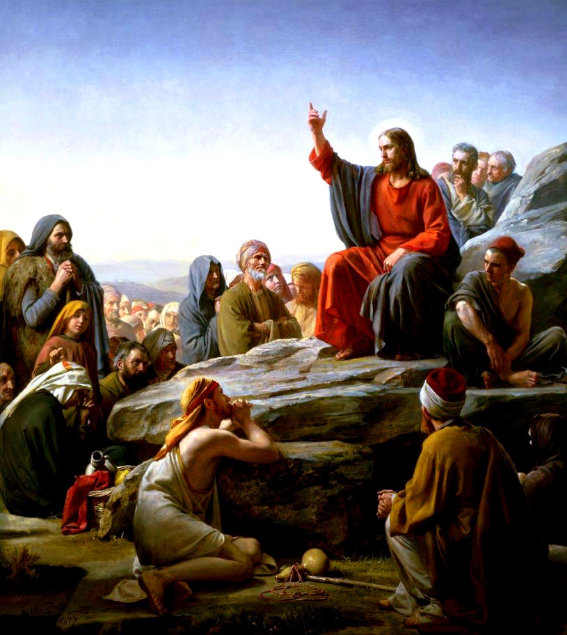

*(Updated Fri, Dec 26 2025.)*

Another interesting potential quirk of the Aramaic language, specifically the Galilean dialect, may clear up a small source of confusion that presents itself between two of the Gospel accounts: The **Sermon on the Mount** (Matthew 5-7) and the **Sermon on the Plain** (Luke 6).

Scholars have spilled much ink over comparing these accounts, finding parallels between the teachings found in these portions, even when some of the sayings don't quite fall into the same places. For example, we have:

- **The Beattitudes** (Mt 5:2-12; Lk 6:20-23)
- **Love Your Enemies** (Mt 5:38-48; Lk 6:27-36)
- **Do Not Judge, Lest You be Judged** (Mt 7:1-2a; Lk 6:37-38)
- etc. etc.

However, despite all of these parallels and similarities, one thing has always been puzzling and a matter of great contradiction: Why does Matthew say that the sermon was shared on a **mountain (ὄρος = _/oros/_)**, where Luke says Jesus descended a mountain and shared his preaching on a **plain (πεδινός = _/pedinos/_)**? Aren't those two things rather opposite, glaring details?

## Tricky Terrain

The answer may rest within the Aramaic word טורא */ṭawrā'/* which in Galilean is usually spelled  */ṭaurah/*. Where in most Aramaic dialects, it means "mountain" in Galilean it can mean either "**mountain**" or "**field**."^[Or "wild" (which it shares with Syriac). Kaufman in the CAL speculates that this is likely from using it to describe the "highland pasture" that was common in "hilly Semitic terrain," cognate with the Akkadian *šadû* and Hebrew שָׂדֶה.]

-  */ṭur beyṯ maqdašah/* = "Temple Mount"^[ *ṭur* is the construct form of  *ṭaurah* which is used in certain compounds.]
-  */ṭur talgah/* = "Snowy Mountain" (a title)
-  */`aḵbarah də-ṭaurah/* = "Field mouse"
-  */pa`laya' həwu bə-ṭaura'/* = "The workers were in the field."

## A Sermon on *What* Precisely?

Furthermore, given the strong themes of the *Sermon on*  we can also see a second parallel: With the Hebrew word **תורה */torah/*, the Law of Moses**.

So an additional pun on the title of this collective passage would be **"The Sermon on/about the Torah"**.

## Conclusion

As the early oral traditions circulated and were re-told many times before they were written down in the Gospels, this kind of confusion could have happened easily. Galilean Aramaic speakers (who were among the first of Jesus' followers) might not have caught the distinction without context, and once the story was translated into another dialect of Aramaic, or even another language such as Koine Greek (which is what the New Testament was compiled in) the sense in that telling was codified, and wordplays were lost.